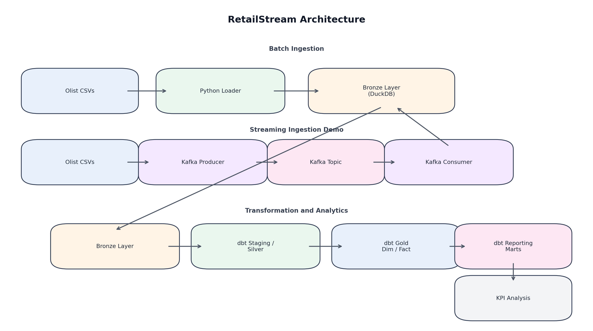

# RetailStream: Kafka + dbt + DuckDB Data Engineering Pipeline

## Executive Summary
RetailStream is an end-to-end data engineering project built around a retail marketplace use case using the Olist e-commerce dataset. The business scenario is straightforward: a retail company has raw operational marketplace data and needs trusted, analytics-ready tables to answer questions about revenue, product performance, customer retention, and seller operations.

This project turns raw source data into a structured DuckDB warehouse through batch ingestion, Kafka-based streaming ingestion, dbt transformations, testing, and reporting marts. The result is a reproducible data pipeline that supports downstream analytics without requiring analysts to work directly with raw source files.

## Why This Project Matters
- It separates raw, cleaned, modeled, and business-facing layers so analytics can be built on trusted data.
- It supports reporting and KPI analysis without exposing raw operational data directly to end users.
- It demonstrates both batch ingestion and streaming ingestion in the same project.
- It shows practical use of dbt models, dbt tests, and Python-based data quality checks in a warehouse workflow.

## Architecture Overview
RetailStream combines batch ingestion, streaming ingestion, warehouse modeling, and reporting in a single pipeline.



```text
Olist CSVs -> Python Batch Loader -> Bronze Tables in DuckDB
Olist CSVs -> Kafka Producer -> Kafka Topic -> Kafka Consumer -> Bronze Tables
Bronze -> dbt Staging/Silver -> dbt Gold Dim/Fact Models -> dbt Reporting Marts -> KPI Analysis
```

See [docs/architecture.md](docs/architecture.md) for the full architecture diagram and layer overview.

## Dataset
The project uses the **Olist eCommerce dataset**, a public retail marketplace dataset containing order, customer, product, seller, payment, and review data.

Core source files used in this project:
- orders
- order_items
- customers
- products
- sellers
- payments
- reviews

These files are ingested from the raw dataset into Bronze tables in DuckDB and then transformed through dbt into analytics-ready models.

## Tech Stack
- Python
- DuckDB
- Apache Kafka
- Docker
- dbt Core
- SQL

## Repository Structure
- `bronze/`
  Contains Bronze-layer table creation logic for DuckDB.
- `ingestion/`
  Contains the batch loader and Kafka producer/consumer scripts used for ingestion.
- `pipeline/`
  Contains orchestration and KPI analysis logic, including the main pipeline runner.
- `dbt_retailstream/`
  Contains the dbt project, including staging models, dimensional models, fact models, reporting marts, and schema tests.
- `quality/`
  Contains Python-based warehouse quality checks and the generated quality report.
- `docs/`
  Contains architecture and data dictionary documentation.
- `data/`
  Contains raw source files and the DuckDB warehouse file.

## Pipeline Layers
### Bronze
The Bronze layer stores raw, source-preserving data in DuckDB. It is designed to keep the source structure recognizable while making the data queryable in the warehouse.

### Staging/Silver
The Staging/Silver layer is implemented with dbt staging models. This layer applies filtering, deduplication, safe casting, null handling, and standardization so the data is ready for dimensional modeling.

### Gold
The Gold layer implements a star schema with dimension tables and a central fact table. This layer is designed for consistent joins, KPI analysis, and downstream reporting.

### Reporting Marts
The reporting marts are business-ready aggregate tables built on top of the Gold layer. They simplify recurring analysis for sales, product performance, customer retention, and seller operations.

## Tables and Models
### Bronze tables
- `bronze_orders`
- `bronze_order_items`
- `bronze_customers`
- `bronze_products`
- `bronze_sellers`
- `bronze_payments`
- `bronze_reviews`
- `bronze_metadata`

### dbt staging models
- `stg_orders`
- `stg_order_items`
- `stg_customers`
- `stg_products`
- `stg_sellers`
- `stg_payments`
- `stg_reviews`

### Gold models
- `dim_customers`
- `dim_products`
- `dim_sellers`
- `dim_date`
- `fact_orders`

### Reporting marts
- `mart_sales_daily`
- `mart_product_performance`
- `mart_customer_retention`
- `mart_seller_performance`

## Data Quality and Testing
RetailStream includes both dbt-native validation and Python-based warehouse quality checks.

- `57` dbt tests passed
- `10` Python quality checks passed
- dbt coverage includes not-null, unique, accepted values, and relationships tests
- Python validation writes a machine-readable report to `quality/quality_report.json`

This combination helps validate both model-level assumptions and business-facing warehouse integrity.

## Orchestration
The main orchestration entry point is `pipeline/run_pipeline.py`.

It runs the pipeline in this order:
- create Bronze tables
- load Bronze data
- `dbt run`
- `dbt test`
- Python quality checks
- KPI analysis

The script stops immediately if any step fails, which makes the pipeline easier to validate and rerun consistently.

## KPI Results
Final pipeline outputs include:

- Total Revenue: approximately `20.3M`
- Average Order Value: approximately `180.28`
- Top State by Orders: `SP`
- dbt run: `16 models completed`
- dbt test: `57/57 passed`
- quality checks: `10/10 passed`

## How to Run
Run the full pipeline from the project root:

```powershell
pip install -r requirements.txt
docker compose up -d
python pipeline/run_pipeline.py
```

Optional dbt-only workflow:

```powershell
cd dbt_retailstream
dbt run
dbt test
```

Optional Kafka demo:

```powershell
python ingestion/producer.py
python ingestion/consumer.py
```

## Documentation
- [docs/data_dictionary.md](docs/data_dictionary.md)
- [docs/architecture.md](docs/architecture.md)

## Key Learnings
This project demonstrates:

- warehouse design using layered data modeling
- dbt transformations for staging, dimensional models, and reporting marts
- star schema modeling for analytics-ready warehouse design
- Kafka-based streaming ingestion alongside batch ingestion
- data validation through dbt tests and Python quality checks
- reproducible orchestration through a single pipeline runner
